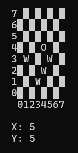
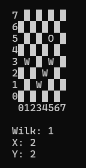

# Game Compiler

This is an enigneering degree project, which aims to create a programming language dedicated for defining game rules. It works as a C++ library, which can compile a source file, written in custom game language, into the game object. This object can be then used to run the game with any interface provided by the user.

## How the language works

The source code of the language is divided into 4 segments:

* Players

This section defines types and number of players

* Game state

This section declaires all data describing the game state

* Main rule

Which is a stop condition - defines conditions of ending the game and results for every player

* Moves

This section declares a move set for every player type, it handles correctness of the move and it's impact on the game state

## Demo

As a demonstration the simple game in "Wolves and a sheep", played on the 8 x 8 chess board, was coded in the game language, along with the interface in a console. One player moves the sheep and the other one wolves, trying to trap a sheep.

